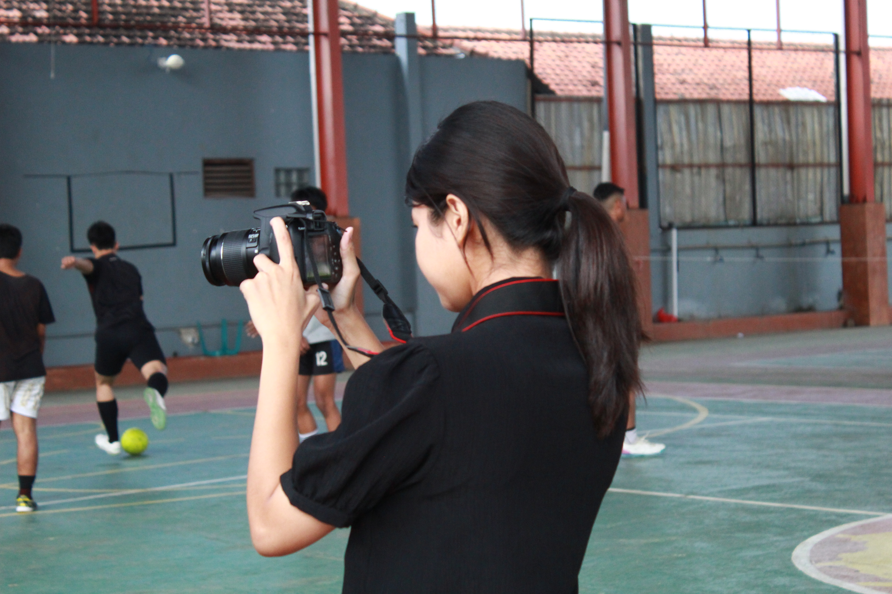

<!DOCTYPE html>
<html lang="id">
<head>
  <meta charset="UTF-8" />
  <title>Happy Birthday Tilamm</title>
  <meta name="viewport" content="width=device-width, initial-scale=1" />
  
</head>
<body>
  <button id="playBtn">▶ Play</button>

  

  

  

  

  

  

    

Happy Birthday Tilamm

    

Semoga kita bisa terus berlanjut hingga tutup usia

    

Banyak hal kan lam, tapi kita tetep kita

    

Proud Of You Tilamm

    

Selamat Ulang Tahun Tilam, aku bakal selalu disinii

    

      

        
      

      
✨ Wish U All The Best Tilamm ✨

      

    

  

  
  <audio id="bgm" loop><source src="ifonly.mp3" type="audio/mpeg"></audio>

  
</body>
</html>
